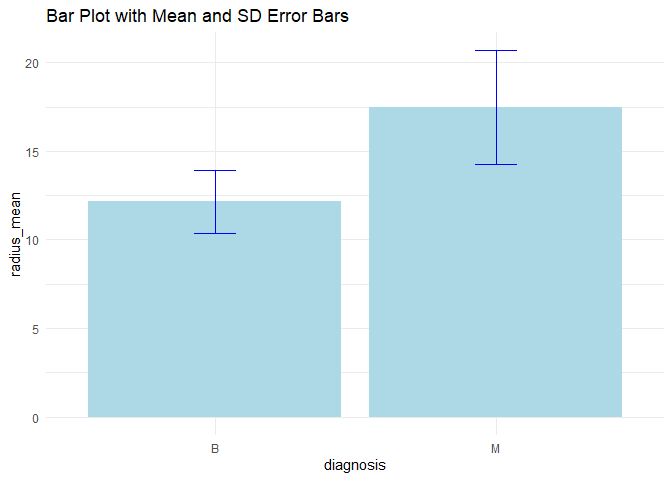
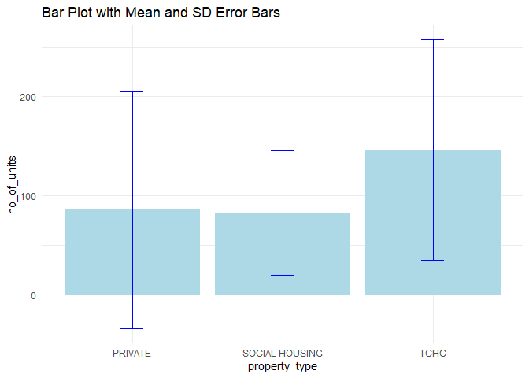
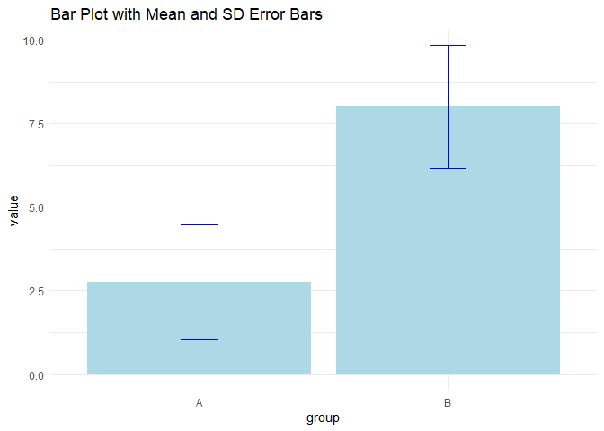

Assignment b-1 Making a Function
================

## Exercise 1: Make a Function (25 points) and Exercise 2: Document your Function (20 points)

### Making a function for a bar graph with standard deviation error bars

I will create a function that **generates a bar graph** (using ggplot2)
where the x-axis variable is categorical and the y-axis variable is
numerical. This function will also **generate error bars** based on the
standard deviation. This is a common type of plot I generate with my own
data and will be useful for future data visualization. In the following
code chunk, I will both (1) make the function and (2) use **roxygen2
tags** to document the function.

``` r
#' Title: Generate bar graph plot with SD error bars
#' Description: This function creates a bar graph plot displaying the mean of a numerical y-variable with standard deviation error bars, across a specified categorical x-variable.

#' @param data A dataset containing the variables to be plotted.
#' @param x_var The categorical variable to be plotted on the x-axis.
#' @param y_var The numerical variable to be plotted on the y-axis.
#' @param error_bar_width A numeric value specifying the width of the error bars (default is 0.15).
#' @return A ggplot object of the bar graph with mean values and error bars.

# Libraries necessary for this function
library(ggplot2)
```

    ## Warning: package 'ggplot2' was built under R version 4.3.3

``` r
library(dplyr)
```

    ## Warning: package 'dplyr' was built under R version 4.3.3

    ## 
    ## Attaching package: 'dplyr'

    ## The following objects are masked from 'package:stats':
    ## 
    ##     filter, lag

    ## The following objects are masked from 'package:base':
    ## 
    ##     intersect, setdiff, setequal, union

``` r
# Making the function
plot_with_error_bars <- function(data, x_var, y_var, error_bar_width = 0.15) {
  
    if (nrow(data) == 0) {
    stop("Data frame is empty. Please provide a data frame with rows.")
    }
  
      if (any(is.na(data[[deparse(substitute(y_var))]]))) {
    warning("There are NA values present in this dataset.")
  }
  
  stopifnot(is.numeric(data[[deparse(substitute(y_var))]]))

# Preparing the data for the plot
  plot_data <- data %>%
    group_by({{ x_var }}) %>%
    summarise(
      mean_y = mean({{ y_var }}, na.rm = TRUE),
      sd_y = sd({{ y_var }}, na.rm = TRUE),
      .groups = 'drop'
    )
  
# Generating the bar graph plot
  plot <- ggplot(plot_data, aes(x = {{ x_var }}, y = mean_y)) +
    geom_bar(stat = "identity", fill = "lightblue") +  
    geom_errorbar(aes(ymin = mean_y - sd_y, ymax = mean_y + sd_y), 
                  width = error_bar_width, color = "blue") +  
    labs(x = deparse(substitute(x_var)), y = deparse(substitute(y_var)), 
         title = "Bar Plot with Mean and SD Error Bars") +
    theme_minimal()

  return(plot)
}
```

## Exercise 3: Include examples (15 points)

In the following two code chunks, you will find **examples** of the bar
graph plot using datasets from the **datateachr package**.

``` r
library(datateachr)

# First, I will test the function with the cancer_sample dataset, using diagnosis as the categorical x_var and radius_mean as the numerical y_var

plot1 <- plot_with_error_bars(cancer_sample, diagnosis, radius_mean)
print(plot1)
```

<!-- -->

``` r
# Second, I will test the function with the apt_buildings dataset, using property_type as the categorical x_var and no_of_units as the numerical y_var

plot2 <- plot_with_error_bars(apt_buildings, property_type, no_of_units)
print(plot2)
```

<!-- -->

## Exercise 4: Test the Function (25 points)

I will now show **three different tests** (in three different code
chunks) to test my plot_with_error_bars() function.

#### Test 1: use expect_error()

``` r
library(testthat) 
```

    ## Warning: package 'testthat' was built under R version 4.3.3

    ## 
    ## Attaching package: 'testthat'

    ## The following object is masked from 'package:dplyr':
    ## 
    ##     matches

``` r
# Test 1: use expect_error() to test if the x_var is categorical and the y_var is numerical

# I will show how the test passes (i.e. an error IS expected) if the y_var is non-numerical:

# Test dataset 1: Non-numeric data frame
data_non_numeric <- data.frame(group = rep(c("A", "B"), each = 5),
                               value = c("a", "b", "c", "d", "e", "f", "g", "h", "i", "j"))

test_that("plot_with_error_bars function works correctly", {
  expect_error(
    plot_with_error_bars(data_non_numeric, group, value),
    "is.numeric(data[[deparse(substitute(y_var))]]) is not TRUE",
    fixed = TRUE
  )
})
```

    ## Test passed 🥇

#### Test 2: use expect_s3_class()

``` r
# Test 2: use expect_s3_class() to test if the function returns an output of a ggplot object using ggplot2

# First, I will show how when using a datateachr dataset, the test will pass (and a ggplot2 object will be produced)
test_that("plot_with_error_bars function works correctly", {
  test_plot1 <- plot_with_error_bars(cancer_sample, diagnosis, radius_mean)
  expect_s3_class(test_plot1, "gg") 
})
```

    ## Test passed 🥇

#### Test 3: use expect_warning()

``` r
# Test 3: use expect_warning() to test if the function returns a warning message, but also still returns a ggplot2 object output

# I will show both (1) how the function alone produces an error message if a dataset is used that contains NA values, then (2) how using the expect_warning() function shows the test passes when a dataset is used that contains NA values.

# First, I will show how with the function alone, (i.e., no test_that() function yet) an error message will be raised when there are NA values present in the dataset
# Test dataset 3: contains NA values
data_with_na <- data.frame(group = rep(c("A", "B"), each = 5),
                           value = c(1, 2, 3, NA, 5, 6, 7, NA, 9, 10))

plot3 <- plot_with_error_bars(data_with_na, group, value)
```

    ## Warning in plot_with_error_bars(data_with_na, group, value): There are NA
    ## values present in this dataset.

``` r
print(plot3)
```

<!-- -->

``` r
# Second, I will show how the test passes using expect_warning(), proving that the function will correctly raise a warning message
test_that("plot_with_error_bars generates a warning with NA values", {
  expect_warning(
    plot_with_error_bars(data_with_na, group, value),
    "There are NA values present in this dataset."
  )
})
```

    ## Test passed 🎊
